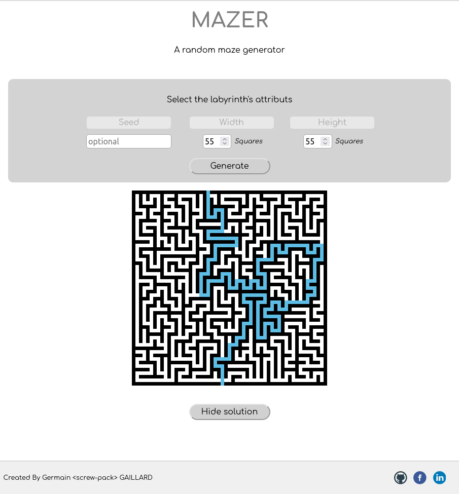

# Mazer  
Mazer is a random maze generator, made with python3 and Flask Framework.



## Heroku app
You can try Mazer here: https://sp-mazer.herokuapp.com/

- choose width and height for the maze (min = 3, max = 107).
- seed is optional.
- click the Generate button to generate the labyrinth.
- click the Solution button at the bottom to show the solution path.

## Console mode
Launch console_mode.py to run Mazer in a console.

- enter width and height for the maze (min = 3, max = 159).
- seed is optional.

Console Commands are :
- **quit** : to quit the program.
- **gen** : to generate another maze.
- **solve** : to solve the maze.
- **txt** : to create a txt file of the maze (! the previous will be over-written).
- **json** : to create a json file of the maze (! the previous will be over-written).

Note: If you want the solution in txt or json file, solve the maze before.

## Localhost mode
Fork it, clone it and create a virtual env.
It requires to install the modules from requirement.txt : ```pip install -r requirements.txt```
launch run_app.py and open your web browser at http://localhost:5000 to run Mazer in a web page.
